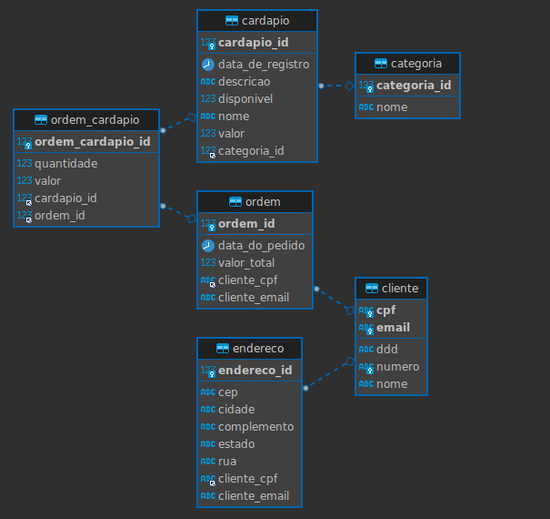
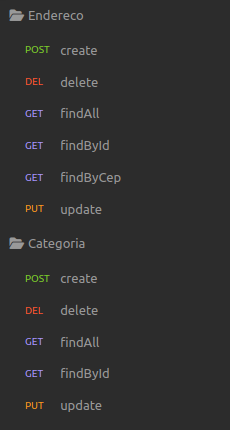
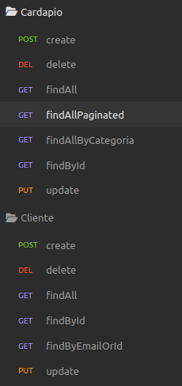

<h1 align="center">Rasfood Spring Data JPA</h1>

A project to practice some important concepts about Spring Data JPA.

<h2 align="center">Database</h2>

<h2 align="center">CRUD Methods</h2>

<h2 align="center">Tecnologies:

Java 17
 Spring 3.0.6
 Spring Data
 Spring Web
 Native and JPQL Queries
 Docker
 MySQL</h2>

